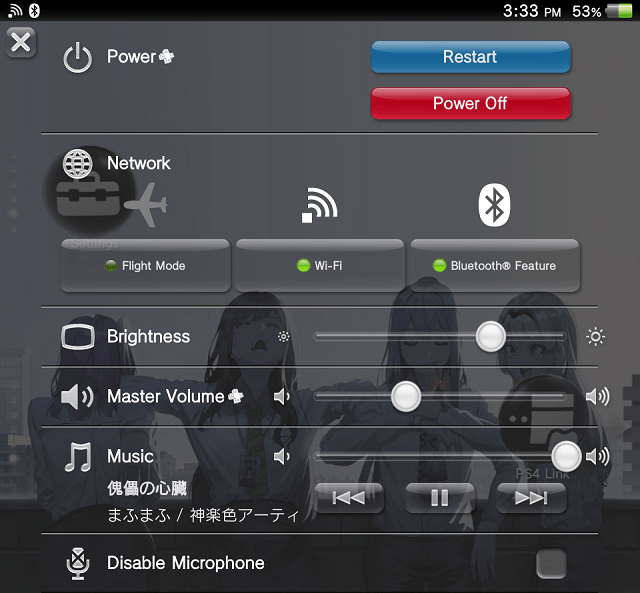
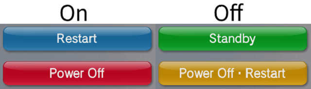
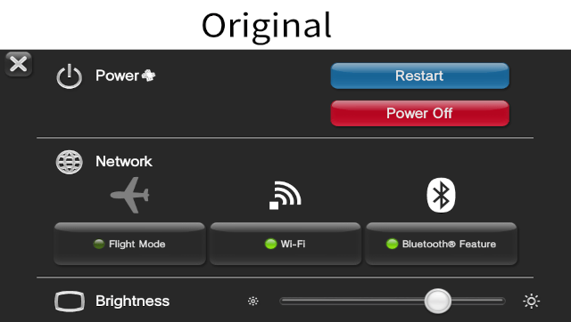
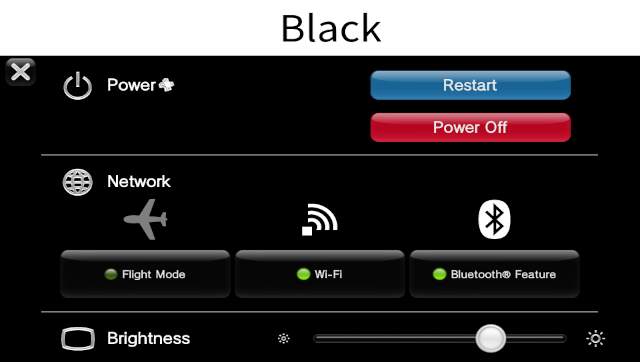
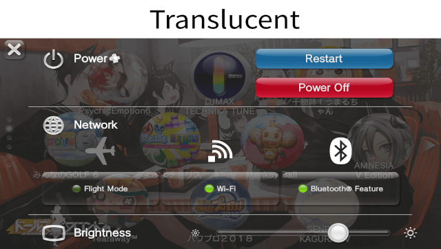

# Quick Menu Plus

Quick Menu Plus adds the following features to the Quick Menu on the PlayStation Vita and PlayStation TV.

- Power off, restart, and standby buttons
- Configurable power buttons
- Volume slidebar
- Faster Quick Menu open time
- Custom background styles
- Configurable background gradient



## Installation

Supported firmware versions:

- Retail 3.60-3.73
- Testkit 3.60, 3.65
- Devkit 3.60

Write the file path in the `*main` section of your taiHEN config.

```
*main
ur0:/tai/quickmenuplus.suprx
```

## Configuration

Put files in the directory `ur0:/data/quickmenuplus` to configure Quick Menu Plus.

- `pushtime.txt` sets the Quick Menu PS button push time. Put in the file the desired push time in microseconds. For example, put `250000` for 250 milliseconds. If the file does not exist, the default time is 500 milliseconds.

- `standbyisrestart.txt` sets the standby button to function as a restart button. Put in the file `1` to enable, or `0` to disable. If the file does not exist, the default is enabled on the Vita, and disabled on the PSTV. When this setting is disabled, hold the "Power Off・Restart" button to restart, and press to power off.

    

- `bgstyle.txt` sets the background style. Put in the file `0` for original, `1` for translucent, and `2` for black. If the file does not exist, the default is original. Black can reduce power consumption for OLED screens.

    
    
    

- `bggradient.txt` sets the background gradient effect. Put in the file `0` to disable, and `1` to enable. If the file does not exist, the default is "enabled"

## Building

Dependencies:

- [VitaSDK](https://vitasdk.org)
- [paf-RE](https://github.com/VitaArchive/ScePaf-RE/tree/c-compat)


Logging can be configured with CMake variables.

To build dependencies and module:

```sh
cmake -S . -B build -DCMAKE_BUILD_TYPE=Release
cmake --build build
```

## Contributing

Fell free to open issues and pull requests for the project!

## Credits

- Princess-of-Sleeping: Tip for SceShellUtil, ScePaf
- Team CBPS: For the original project

## See also

<!-- - [Discussion](https://forum.devchroma.nl/index.php/topic,78.0.html) -->
- [Source repository](https://github.com/VitaArchive/QuickMenuPlusMod)
